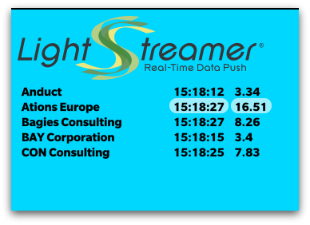

# Lightstreamer - Basic Stock-List Demo - BlackBerry (WebWorks) Client #



This demo shows how to use the Lightstreamer JavaScript Client library and the [BlackBerry 10 WebWorks SDK](http://developer.blackberry.com/html5/) to create a simple streaming-enabled application.

Real-Time simulated Stock-List data is received from the Lightstreamer Server deployed @ [http://push.lightstreamer.com](http://push.lightstreamer.com)

# Build #

There are different ways to convert an Html application to run on BlackBerry 10. This README will focus on the use of the command line tools. Feel free to check the [other possibilities](http://developer.blackberry.com/html5/)

*   Download and install the [BlackBerry 10 WebWorks SDK](http://developer.blackberry.com/html5/download/) (scroll down a little to find them)
*   Download and install [VMware Player](http://www.vmware.com/products/player/) for Windows or [VMware Fusion](http://www.vmware.com/products/fusion/overview.html) for Mac.
*   Download and install the [BlackBerry 10 Simulator](https://developer.blackberry.com/devzone/develop/simulator/simulator_installing.html)
*   Download the [Lightstreamer distribution](http://www.lightstreamer.com/download) and copy the lightstreamer.js file from the Lightstreamer JavaScript Client SDK (that is located under the DOCS-SDKs/sdk_client_javascript/lib folder) into the stocklist/lib folder of this project.
*   Download the [require.js](http://requirejs.org/) file and copy it into the stocklist/lib folder of this project.

once ready position the command-line to this project folder.

Being $BB_HOME the folder where you installed the WebWorks SDK, run
```
$BB_HOME/bbwp stocklist -o output
```
an output folder will be created containing the results of the packaging; there will be two bar files, one to be used with the simulator, the other to be used with actual devices.

## Run the demo ##

Start the BlackBerry 10 Simulator and take note of the IP address (check the bottom-left of the window the simulator is in)

Being $BB_HOME the folder where you installed the the WebWorks SDK and $IP the IP address of the simulator, run
```
$BB_HOME/dependencies/tools/bin/blackberry-deploy -installApp $IP output/simulator/stocklist.bar
```
The app icon will appear on the simulator home screen.

# See Also #

*   [Lightstreamer JavaScript Client API reference](http://www.lightstreamer.com/docs/client_javascript_uni_api/index.html)

## Lightstreamer Adapters needed by this demo client ##

*   [Lightstreamer - Stock-List Demo - Java SE Adapter](https://github.com/Weswit/Lightstreamer-example-Stocklist-adapter-java)
*   [Lightstreamer - Reusable Metadata Adapters - Java SE Adapter](https://github.com/Weswit/Lightstreamer-example-ReusableMetadata-adapter-java)

# Lightstreamer Compatibility Notes #

*   Compatible with Lightstreamer JavaScript Client library version 6.0 or newer.
